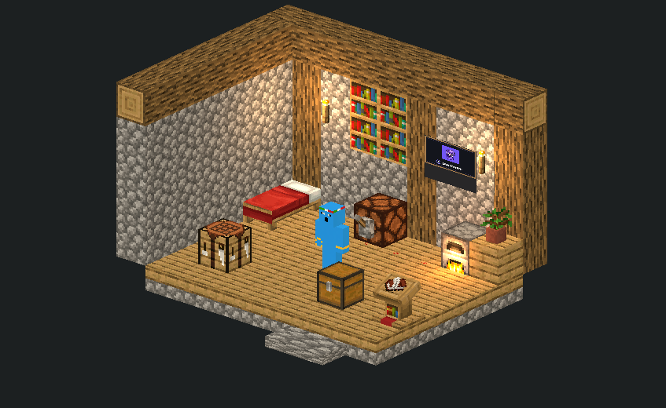
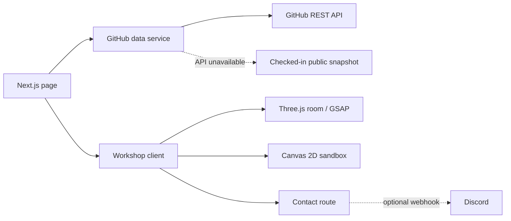

<div align="center">

# PSYMARIUX<br />DEVELOPER WORKSHOP

**A personal portfolio you can walk through.**

Stone walls, oak beams, a real project chest—and the code behind the room.

[Repository](https://github.com/nohint404/psy-portfolio) · [GitHub profile](https://github.com/nohint404) · [PsyStream](https://stream.psymariux.dev)

</div>

<p align="center">
  
</p>

<p align="center"><sub>The room is the navigation: approach a workstation to open the real project, activity or contact panel.</sub></p>

---

## A portfolio with a point of view

I built my portfolio as a little Minecraft workshop rather than a row of software cards. Walk up to the project chest, crafting table, furnace, redstone lamp, message book or PsyStream poster; the character finds a clear route, interacts with the object and opens the matching panel. A labeled shelf keeps the same destinations easy to reach with a keyboard or on a phone. **Ctrl/Cmd+K** searches those destinations and the public repositories already on the page.

**Psymariux** is my developer identity. The portfolio uses **[@nohint404](https://github.com/nohint404)** as its GitHub data source.

### Inside the room

- A Three.js scene built from locally resolved Minecraft Java 1.21.4 models, with the verified PsyMariux skin, a working redstone lever and a hinged chest.
- Real public GitHub projects, repository details and recent activity; an explicit fork disclosure keeps upstream work separate from my own.
- [PsyStream](https://stream.psymariux.dev), my closed-source streaming project, shown as its own product—not passed off as a public repository.
- An optional, saveable shinobi sandbox hidden behind **sleep → wake → sleep**. Its authored village opens onto seeded, procedurally generated terrain, with quests, crafting, combat, farming and building.

<sub>The screenshot uses Minecraft game artwork and a personal skin. Their owners retain their rights; the repository’s AGPL-3.0 license does not relicense those assets. See the image and asset provenance.</sub>

## The quieter details

The room is not just a picture with hotspots. Each destination uses obstacle-aware routes from the character’s current position; the lever interaction reaches for its handle, grips, flips and releases it. The switch state persists when the panel closes. If WebGL cannot start, a captured room preview and the labeled object shelf remain available.

The optional game is a separate, full-screen Canvas experience. It starts with a fixed authored village, then streams deterministic terrain in all directions. Generated chunks are cached within a bound; player-made changes and discoveries are saved. Progress stays in the browser, with validated import/export rather than a server account.

## A quiet record

A vanilla Minecraft jukebox in the room opens a timber-framed pixel miniplayer. C418’s **Sweden** and **Moog City** alternate at the end of each track; choose either disc, pause, skip or adjust the volume (20% by default).

Music is off until you press Play, independent of interaction sound effects. Local MP3s load only on demand—no iframe or external player. Hiding the tab or entering the dream pauses playback without automatically restarting it. Track sources, hashes and rights caveats are recorded in `public/audio/`; the project’s code license does not cover these recordings and their redistribution license has not been independently verified.

## How the pieces fit

The page is server-rendered around a client-side workshop. Public GitHub data is normalized on the server; interactive scenes load only where they are used. The portfolio view, 3D room and sandbox share one experience without sharing a simulation loop.



### The decisions that shape it

- **The room is functional UI.** One obstacle-aware route planner handles the character’s walks; the nine-object shelf is its keyboard/touch equivalent. Reduced-motion preferences skip travel and authored transitions.
- **The GitHub feed is public by construction.** The server paginates repositories, normalizes selected public data, filters activity to the account owner, and uses a checked-in snapshot if the API is unavailable. An optional `GITHUB_TOKEN` stays server-side; private repository data is checked again before serialization.
- **The hidden game keeps its own rules.** `lib/ninja-game.ts` owns simulation and save validation, `lib/ninja-world.ts` owns deterministic terrain, and `lib/ninja-render.ts` draws the pixel world. A bounded generated-chunk cache avoids storing every tile; versioned browser saves preserve player changes.
- **The contact book does not fake a send.** `DISCORD_WEBHOOK_URL` is optional. Without it, the form returns an explicit unavailable response; the route also checks origin, validates input, and limits requests in-process.
- **The world has multiple owners.** Vanilla Minecraft models and textures, the personal skin, PsyStream branding and source-labeled audio keep their own provenance. AGPL-3.0 applies to this project’s licensed code, not third-party artwork or audio.

## How it is built

- **Next.js 16 App Router, React 19 and TypeScript** render the portfolio and its server-side data routes.
- **Three.js** draws the walkable workshop; **GSAP** coordinates character, camera and object interactions.
- The hidden game uses **Canvas 2D**, keeping world simulation, deterministic terrain and rendering in separate modules.
- **Radix Dialog** handles accessible panels and the game shell. Tailwind CSS 4 and local CSS provide the pixel-workshop styling.
- GitHub data is fetched server-side, normalized before display and cached for 30 minutes. A checked-in public snapshot is the outage/rate-limit fallback; no private repository data is exposed.

### Application source map

The paths below point to the application source files in this repository.

| Path | What lives there |
| --- | --- |
| `app/` | Next.js page, layout and `/api/github`, `/api/contact` routes |
| `components/Workshop.tsx`, `components/Scene.tsx` | Portfolio experience and 3D room |
| `components/NinjaDream.tsx` | Hidden sandbox interface and Canvas lifecycle |
| `components/Jukebox.tsx` · `lib/jukebox.ts` | Opt-in local music controls and the two-record playlist |
| `lib/ninja-world.ts`, `lib/ninja-game.ts`, `lib/ninja-render.ts` | Terrain generation, simulation/save validation, and drawing |
| `lib/github-core.ts`, `lib/github.ts` | Public GitHub normalization and server-side cached fetch |
| `config/portfolio.ts` | Explicitly featured public repositories |
| `public/minecraft/`, `public/art/` | Bundled visuals and per-asset provenance |
| `tests/` | Game, data-boundary, interaction and asset checks |

## Local development

The application uses Node.js 22.18+ and npm (`package-lock.json`). Clone this repository, then run:

```sh
git clone https://github.com/nohint404/psy-portfolio.git
cd psy-portfolio
npm ci
cp .env.example .env.local
npm run dev
```

Open [http://localhost:3000](http://localhost:3000). The checked-in GitHub snapshot makes the page usable without API credentials. `GITHUB_TOKEN` is optional and server-only; do not use a `NEXT_PUBLIC_` token. `DISCORD_WEBHOOK_URL` is optional and enables message delivery; without it, the form reports that delivery is unavailable. `NEXT_PUBLIC_SITE_URL` sets the canonical and Open Graph origin.

Useful checks and maintenance commands:

```sh
npm test
npm run lint        # ESLint and TypeScript
npm run build
npm start           # serve the production build
npm run github:snapshot
```

`vercel.json` configures the Next.js build. The live PsyStream project is linked above; this repository is the portfolio source.

## License and image credits

[`LICENSE`](LICENSE) applies GNU AGPL-3.0 to the repository’s covered code. It does not relicense Minecraft artwork, the personal skin, PsyStream branding, or third-party audio. Those retain their respective owners’ rights. Provenance for the included screenshot is in [`docs/readme/workshop.webp.provenance.json`](docs/readme/workshop.webp.provenance.json). Asset sources and provenance are recorded beside files under `public/`; those third-party works remain outside the AGPL code license.
